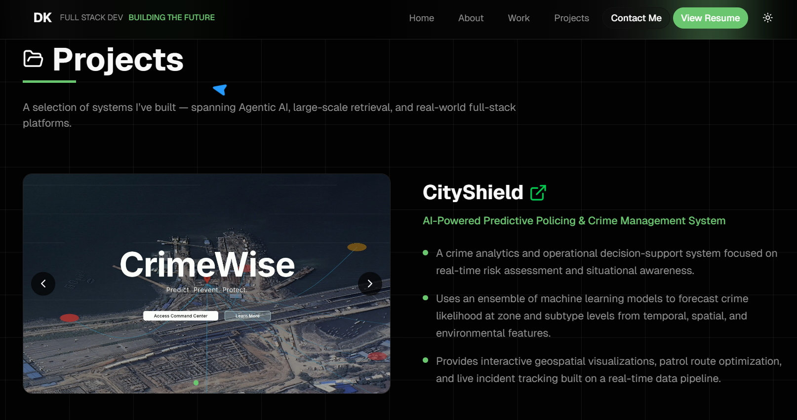

# Durva Kadam Portfolio

A modern, responsive, and animated portfolio website for Durva Kadam, Full Stack Developer. Built with Next.js, React, Tailwind CSS, and AOS for smooth scroll-based animations.

<div align="center">
  <a href="https://durvakadam.vercel.app" target="_blank" rel="noopener noreferrer">
    
  </a>
</div>

### Landing Page


### Projects


## 🚀 Getting Started

1. **Clone the repository:**
   ```bash
   git clone https://github.com/yourusername/durva-portfolio.git
   cd durva-portfolio
   ```
2. **Install dependencies:**
   ```bash
   pnpm install
   # or
   npm install
   ```
3. **Run the development server:**
   ```bash
   pnpm dev
   # or
   npm run dev
   ```
4. **Open in your browser:**
   Visit [http://localhost:3000](http://localhost:3000)

## © All rights reserved.
